## Описание

Этот проект представляет собой Telegram-бота, разработанного для управления обучающими курсами и отслеживания зарплаты преподавателей. Бот предоставляет различным пользователям функциональности в зависимости от их роли: студенты могут просматривать свои курсы, администраторы могут управлять курсами и преподавателями, а также генерировать отчеты о зарплате.

## Особенности

- **Авторизация и ролевой доступ**: Пользователи могут авторизоваться в боте, получая доступ к определенным функциям в зависимости от их роли (студенты, преподаватели, администраторы).
- **Управление курсами**: Администраторы могут добавлять, удалять и просматривать курсы, а также назначать преподавателей для каждого курса.
- **Отслеживание зарплаты**: Бот позволяет администраторам генерировать отчеты о зарплате преподавателей за определенный период времени, учитывая различные тарифы и оплаты.

## Использование

1. Установите необходимые зависимости, перечисленные в `requirements.txt`.
2. Создайте базу данных SQLite с помощью предоставленного скрипта или используйте свою собственную базу данных.
3. Укажите токен вашего бота Telegram в переменной окружения `TELEGRAM_BOT_TOKEN`.
4. Запустите бота с помощью скрипта `main.py`.

### Скриншоты от лица "Преподавателя".
1. **Меню**:
   <br>
   ![Меню]BOT2/menu.png)

2. **Действие "Моя Зарплата"**:
   <br>
   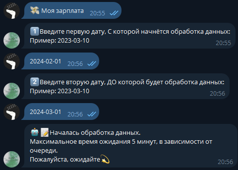

3. **Результат действия "Моя Зарплата"**:
   <br>
   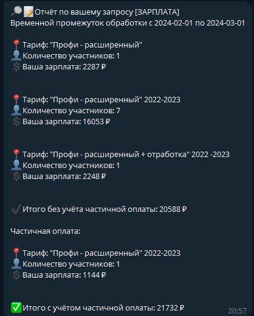

4. **Действие "Мои курсы**:
   <br>
   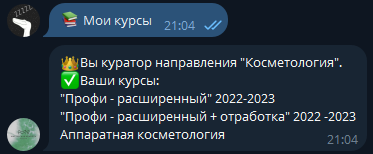

   ### Скриншоты от лица "Админа".
1. **Меню Админ Панели**:
   <br>
   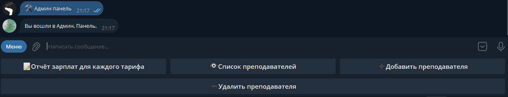

2. **Отчёт зарплат для каждого тарифа**:
   <br>
   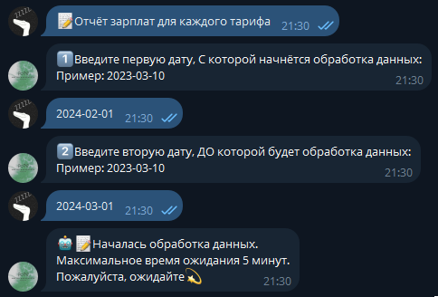

3. **Результат действия "Отчёт зарплат для каждого тарифа"**:
   <br>
   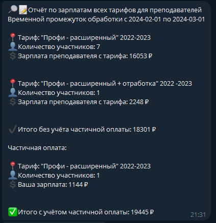

4. **Действие "Добавить преподавателя"**:
   <br>
   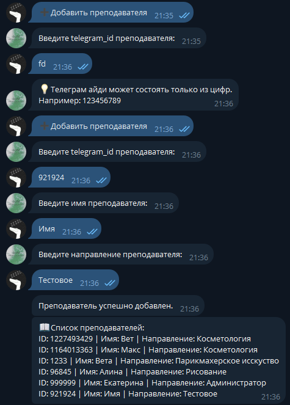
5. **Действие "Удалить преподавателя"**:
   <br>
   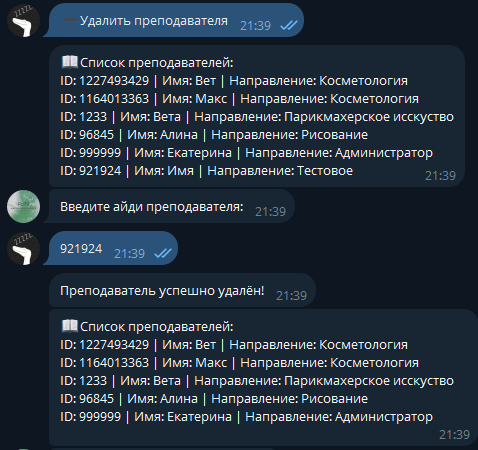

## "Секретные" команды
   Супер-админы могут через команду менять информацию о себе:
   - Команда `/admin_change` - Выдаёт себе роль администратором / Убирает с себя роль администратора. Отображение ввиде Эмоджи.
     <br>
   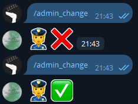
   - Команда `/change` - Изменяет кураторство курса (Если был курс "Косметология", то станет "Массаж", и наоборот). Отображение в виде Эмоджи (Помада = Косметология) (Девушка и руки = Массаж)
     <br>
   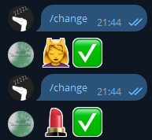

## Защита от "Дурака"
   Проект создавался для людей, а всегда найдётся человек - который может случайно сломать программу.
   В программе реализована некая "Защита", которая предотвращает/не обрабатывает/выкидывает исключение от нежелательно/неверного ввода команд, букв, цифр, иных символов при общении с ботом.
   <br>
   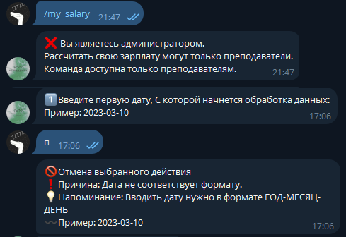
   
   

## Видео-Демонстрация БОТ 2
**Демонстрация**:
   

## Установка

1. Клонируйте репозиторий:
   ```bash
   git clone https://github.com/Faunas/API_Stats_GetCourse.git
   ```
2. Создайте базу данных SQLite и настройте переменные окружения.
3. Запустите бота:
   ```bash
   python salary_for_employees_bot.py
   ```
